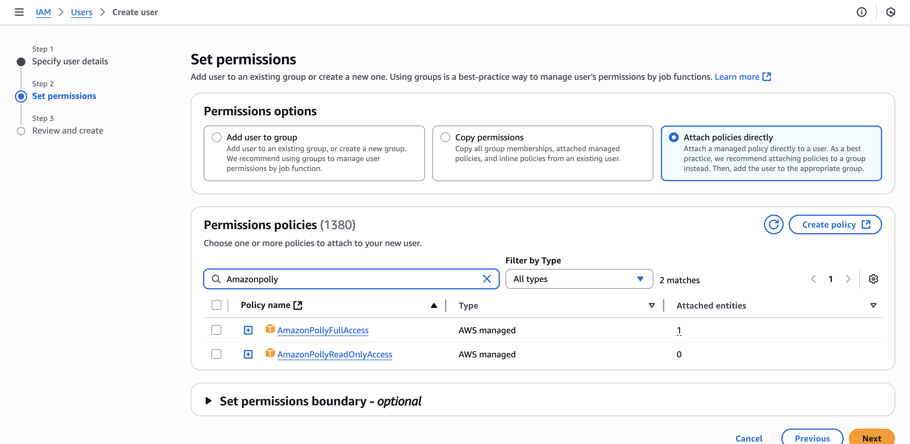
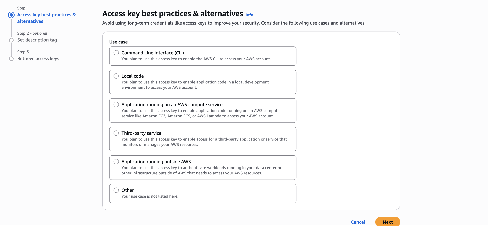
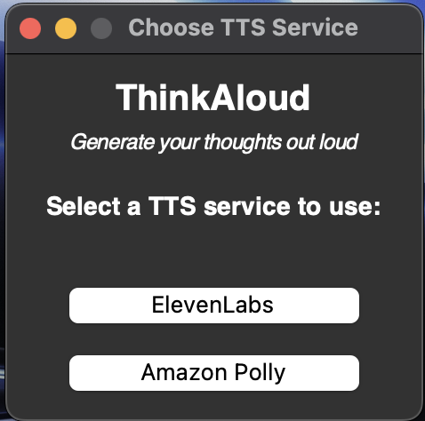
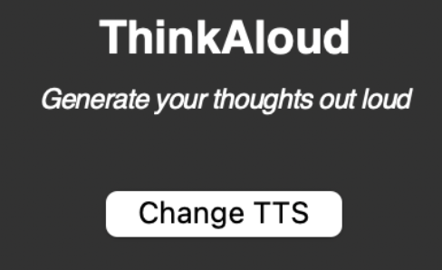
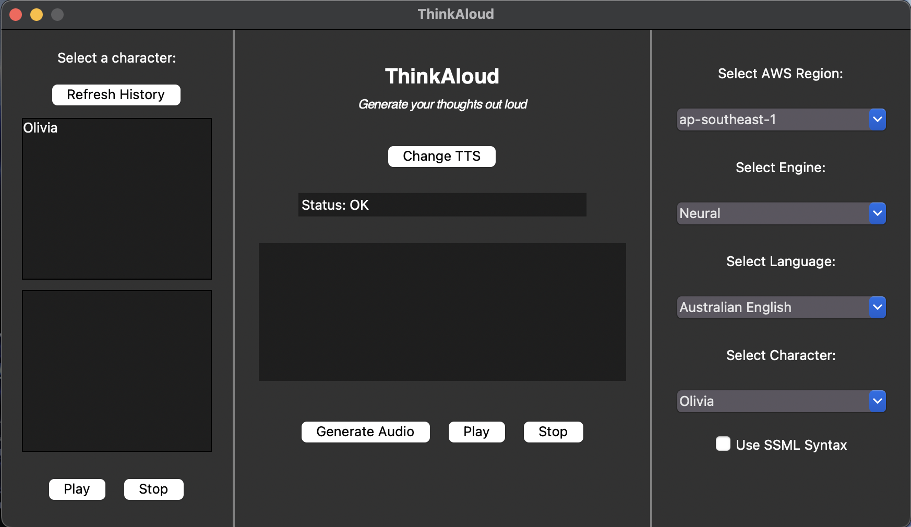
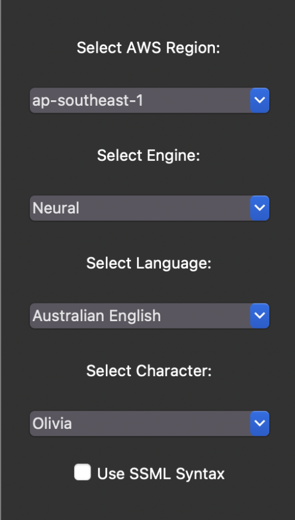

# ThinkAloud User Guide


ThinkAloud is designed for teachers who need to create natural sounding audio recordings for their online teaching resources.

With multiple TTS services available and multiple voices with many configuration options, ThinkAloud can help teachers who have busy schedules to find suitable options among many choices. Teachers can get more value out of free tiers and evaluate services easily before upgrading to paid tiers.


## Account Creation
### For ElevenLabs TTS:
1. Sign up for a free Elevenlabs account [here](https://elevenlabs.io/app/sign-up).
1. Follow this [video](https://www.youtube.com/watch?v=BqJyiNFE9pA) to generate a API token. Copy the API token into a notepad as you will need it later.

### For Amazon Polly TTS:
1. Sign up for a free-tier AWS account [here](https://ap-southeast-2.signin.aws.amazon.com/oauth?client_id=arn%3Aaws%3Asignin%3A%3A%3Aconsole%2Fcanvas&code_challenge=QRwkRXgXV_bpT5FNWGPpMBa36LeW8OZTeGwKvWezbyw&code_challenge_method=SHA-256&response_type=code&redirect_uri=https%3A%2F%2Fconsole.aws.amazon.com%2Fconsole%2Fhome%3FhashArgs%3D%2523%26isauthcode%3Dtrue%26nc2%3Dh_si%26src%3Dheader-signin%26state%3DhashArgsFromTB_ap-southeast-2_268872e7f3b5ae5a).
1. After logging into AWS Management Console, search for `IAM` and click into it.
1. Under `Access Management` tab, click on `Users`, then `Create User`.
1. Enter your username and hit `next`.\

1. For permissions, please allow `AmazonPollyFullAccess`.
1. Proceed to review and create the new user.
1. After creating the new user, click into the user.
1. Inside the summary box, click on `Create access key`.\

1. Under the `Access key best practices & alternatives`, select `Application running outside of AWS`.
1. Proceed to fill in the other details and create your access keys.
1. After retrieving your access key, copy the **BOTH** `Access key` and `Secret access key` to a notepad as you will need it later.

## Quick start
1. Download the .exe file [here](https://github.com/TY1Fan/Python-TTS-App/releases). Read the release guide to download the correct file.\

1. For MacOS, on first launch of the app, you will likely face this error `Apple could not verify “app” is free of malware that may harm your Mac or compromise your privacy.`
1. To resolve this, press `done`. Then open System Settings > Privacy & Security. Scroll to the bottom and click `Open Anyway`.
1. Double click on the .exe file to run it. First launch will take some time.\

1. On first launch, you will be prompted to choose a TTS service provider (ElevenLabs or Amazon Polly).
1. Then, you will be redirected to enter the api credentials of the chosen TTS service.
1. After hitting the submit button, the API token window will close. ThinkAloud will show.

## Common Features:

### Changing TTS service provider


Clicking on the `Change TTS` button will bring you back to the TTS selection page where you can choose your prefered TTS service.

### Audio Generation


To generate an audio file:
- Enter your thoughts into the text entry box. The text can be in `SSML` format for more life-like speech synthesis.
- Press the `Generate Audio` button to generate an audio file for the text entry.
- Press `Play` to play the audio file generated and `Stop` to stop the audio playback.

**Note:** Pressing `Play` after `Stop` will replay the audio file from the start. I.e. `Stop` is not a pause button.

### Status Bar


After generating an audio, the status bar will show the status of operation executed.\
The remaining character count display will also update automatically.

### Play Previously Generated Audio


To play previously generated audio files:
- Select a character. Only character which you had used to generate audio file will be displayed.
- Select an audio file from the character.
- Press on the `Play` button to listen to the audio file.
- Press on the `Stop` button to stop the playback.

**Note:** This panel does not refresh automatically. Hence, press the `Refresh History` button to refresh this panel.

## Features (using ElevenLabs TTS):


### Character Usage Count


Displays the remaining character tokens available based on your subscription tier.

### Character Selection


Select a character from the list of preset characters provided by ElevenLabs.\
On selecting a character, the latest settings configuration of the character will be displayed.

### Settings Configuration


These are the settings available for configuration:
- Stability: Ranges from 0 (more variation) to 1 (more stable).
- Similarity Boost: Ranges from 0 (low similarity to original voice) to 1 (high similarity to original voice).
- Style: Ranges from 0 (no exaggeration) to 1 (exaggerated style).
- Speed: Ranges from 0.7 (slower) to 1.2 (faster), in comparison to default speed of 1.
- Use Speaker Boost: Boosts the similarity to the original speaker. 

After altering the settings, press on the `Save Settings` button to save the new settings configuration for the selected character.

**Note:** There will be no updates shown on the `status bar`.

## Features (using Amazon Polly TTS):


### Settings Configuration


These are the settings available for configuration:
- AWS Regions: The list of regions available to the user.
- Engine: The list of TTS engines available based on the region selected (i.e. Standard, Neural, Long-form, Generative).
- Language: The list of languages available based on the region and engine selected.
- Character: The list of pre-set characters available based on the current configuration.
- Use SSML: Check this box if you are going to use SSML formatted text.

## Known Issues:

1. Comestic Bug: `Similarity_boost`\
Description: Currently the similarity boost configurations is labelled as `Similarity_boost`. The underscore is unintended.\
Solution: Currently trying to find a way to remove the underscore without affecting the functionality of the settings panel. Since this bug does not affect the functionality of app, I have decided to backlog for future iterations.

1. Cosmetic Bug: Console launches while using the app.\
Description: When I use the `.exe` file for MacOS, my console launches although I used the flag `--noconsole` while building.\
Solution: Currently trying to find a way to hide the console while my app launches. Since this bug does not affect the functionality of app, I have decided to backlog for future iterations.

## Sources:
```
The audio in this application was generated using either ElevenLabs or Amazon Polly.
Learn more at https://www.elevenlabs.io & https://aws.amazon.com/polly/

Credits to https://www.youtube.com/@HowTo_ish for the ElevenLabs API Token generation tutorial.
``` 