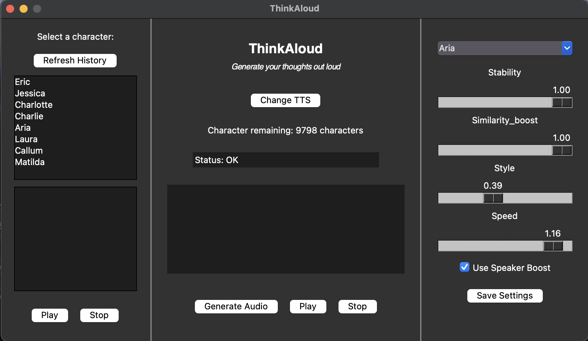
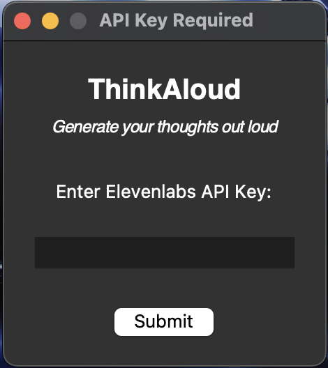
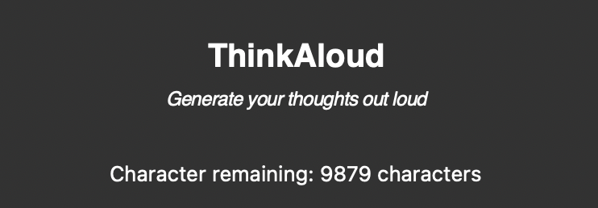
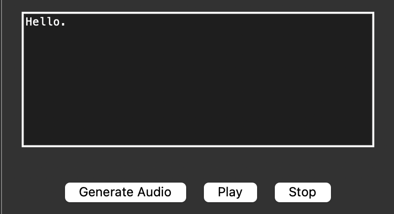
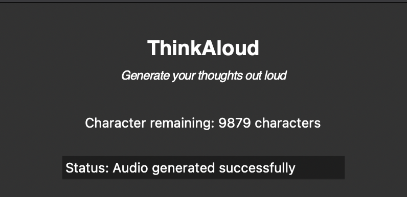
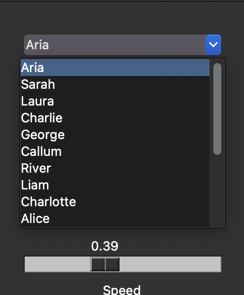
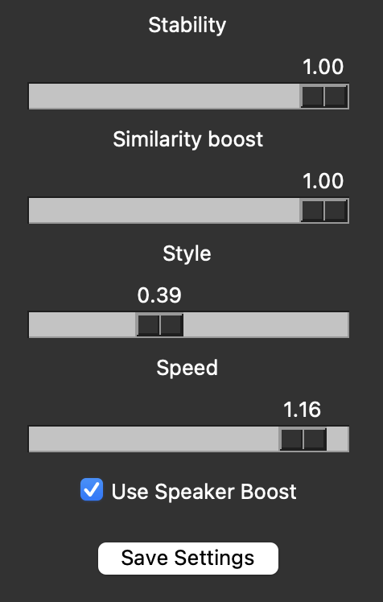
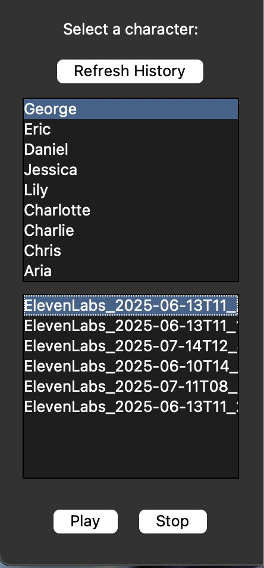

# ThinkAloud User Guide



## Quick start
1. Sign up for a free Elevenlabs account [here](https://elevenlabs.io/app/sign-up)
1. Follow this [video](https://www.youtube.com/watch?v=BqJyiNFE9pA) to generate a API token. Copy the API token into a notepad as you will need it later
1. Download the .exe file [here](https://github.com/TY1Fan/Python-TTS-App/releases). Read the release guide to download the correct file.\

1. For MacOS, on first launch of the app, you will likely face this error `Apple could not verify “app” is free of malware that may harm your Mac or compromise your privacy.`
1. To resolve this, press `done`. Then open System Settings > Privacy & Security. Scroll to the bottom and click `Open Anyway`.
1. Double click on the .exe file to run it. First launch will take some time.\

1. On first launch, you will be prompted to insert your API token.
1. After hitting the submit button, the API token window will close. ThinkAloud will show.

## Features:

### Character Usage Count


Displays the remaining character tokens available based on your subscription tier.

### Audio Generation


Enter your thoughts into the text entry box. The text can be in `SSML` format for more life-like speech synthesis.\
Press the `Generate Audio` button to generate an audio file for the text entry.\
Press `Play` to play the audio file generated and `Stop` to stop the audio playback.

**Note:** Pressing `Play` after `Stop` will replay the audio file from the start. I.e. `Stop` is not a pause button.

### Status Bar


After generating an audio, the status bar will show the status of operation executed. The remaining character count display will also update automatically.

### Character Selection


Select a character from the list of preset characters provided by ElevenLabs.\
On selecting a character, the settings of the character will be displayed.

### Settings Configuration


These are the settings available for configuration:
- Stability: Ranges from 0 (more variation) to 1 (more stable).
- Similarity Boost: Ranges from 0 (low similarity to original voice) to 1 (high similarity to original voice).
- Style: Ranges from 0 (no exaggeration) to 1 (exaggerated style).
- Use Speaker Boost: Boosts the similarity to the original speaker. 

After altering the settings, press on the `Save Settings` button to save the new settings configuration for the selected character.

**Note:** There will be no updates shown on the `status bar`.

### Play Previously Generated Audio


To play previously generated audio files:
- Select a character. Only character which you had used to generate audio file will be displayed.
- Select an audio file from the character.
- Press on the `Play` button to listen to the audio file.
- Press on the `Stop` button to stop the playback.

**Note:** This panel does not refresh automatically. Hence, press the `Refresh History` button to refresh this panel.

## Sources:
```
The audio in this application was generated using ElevenLabs.
Learn more at https://www.elevenlabs.io
``` 